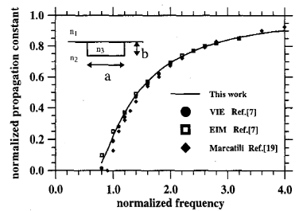

# III. Guia de Onda de Canal Isotrópico Homogêneo

Esta seção apresenta o primeiro caso de validação do artigo e deve ser lida como o teste inicial da formulação em um cenário geometricamente simples e materialmente homogêneo. O interesse desse caso está menos na complexidade física e mais na sua utilidade como referência básica para verificar a montagem do problema modal.

O guia de onda retangular homogêneo foi simulado e os resultados para o modo fundamental $E^x$ foram comparados com outros métodos numéricos (Fig. 1). Este exemplo simples foi utilizado para testar a formulação para guias de onda homogêneos. A Fig. 1 mostra a boa concordância com o método vetorial da equação integral (VIE) e com o método do índice efetivo (EIM) [7]. O método de Marcatili [19] obtém uma constante de propagação menor nas proximidades do corte.

Essa comparação é didaticamente importante porque já introduz um padrão que será repetido ao longo do artigo: o valor da formulação não é avaliado apenas pela obtenção de um modo propagante, mas pela sua capacidade de reproduzir curvas de dispersão compatíveis com resultados consolidados na literatura.



**Fig. 1.** Curvas de dispersão para guia de onda de canal isotrópico homogêneo. A frequência normalizada é

$$
\left(\frac{k_0 b}{\pi}\right)\left(n_3^2 - n_2^2\right)^{1/2}
$$

e a constante de propagação normalizada é

$$
\frac{n_{\mathrm{eff}}^2 - n_2^2}{n_3^2 - n_2^2}.
$$

Os índices de refração são $n_1 = 1.0$, $n_2 = 1.43$ e $n_3 = 1.50$.

Do ponto de vista da futura implementação em C++, este caso deve ser tratado como o primeiro marco de validação: se a extração do modo fundamental, a normalização da curva e a comparação com a literatura falharem aqui, os casos difusos e anisotrópicos posteriores tenderão a mascarar problemas mais básicos de modelagem ou montagem.

## Leitura das referências para o Caso 1

Com base nas referências do diretório `docs/ref`:

- em [7], a seção **3.2 Homogeneous channel waveguide** apresenta explicitamente a comparação do modo `EY1` entre método vetorial da equação integral, elementos finitos, método de Marcatili e EIM;
- o texto de [7] afirma boa concordância entre VIE e FEM, com desvio mais visível de Marcatili em baixas frequências;
- [19] é a referência clássica de Marcatili para guias retangulares dielétricos e fundamenta a curva aproximada usada como comparação de engenharia;
- a geometria citada em [7] também usa a relação `a = 2b` no contexto dos exemplos de canal.

> Observação editorial: há variação de notação entre as fontes (por exemplo, troca de papéis de $n_2$ e $n_3$ em algumas legendas e eixos). Neste repositório, mantemos a convenção da documentação consolidada: $n_3$ como índice do núcleo e $n_2$ como índice do substrato.

## Configuração de reprodução no repositório

Nesta etapa, a reprodução do Caso 1 foi organizada com:

- caso base: [../cases/homogeneous_channel_isotropic_case.yaml](../cases/homogeneous_channel_isotropic_case.yaml)
- pontos de referência visual aproximada da Fig. 1: [../cases/homogeneous_channel_fig1_reference_points.csv](../cases/homogeneous_channel_fig1_reference_points.csv)
- sweep: [../scripts/run_case1_homogeneous_channel_sweep.py](../scripts/run_case1_homogeneous_channel_sweep.py)
- consolidação: [../scripts/consolidate_case1_homogeneous_channel_sweep.py](../scripts/consolidate_case1_homogeneous_channel_sweep.py)
- gráfico: [../scripts/plot_case1_homogeneous_channel_sweep.py](../scripts/plot_case1_homogeneous_channel_sweep.py)
- saída consolidada desta rodada: [../out/case1_homogeneous_channel/reference_run_v3/consolidated/reference_dispersion.csv](../out/case1_homogeneous_channel/reference_run_v3/consolidated/reference_dispersion.csv)

Hipóteses geométricas adotadas:

- `a = 2b`, com `b = 1` e `a = 2`;
- domínio de controle para comparação com o Caso 2: `x in [-5, 5]` e `y in [-3, 7]`;
- domínio de referência do Caso 1: `x in [-10, 10]` e `y in [-6, 14]`;
- malha de controle: [../meshes/channel_a2b_b1_reference.mesh](../meshes/channel_a2b_b1_reference.mesh);
- malha de referência: [../meshes/channel_a2b_b1_farfield.mesh](../meshes/channel_a2b_b1_farfield.mesh);
- modo extraído: ramo fundamental `Ex-like`.

Observação de decisão numérica desta etapa:

- para comparação principal com a Fig. 1, o domínio recomendado no repositório passa a ser o **domínio de referência** (`x in [-10, 10]`, `y in [-6, 14]`);
- o domínio de controle (`10 x 10`) permanece para auditoria de sensibilidade ao truncamento e para comparação direta com o Caso 2.

## Domínio e condições de contorno no Caso 1

Na implementação atual, o Caso 1 usa as mesmas interfaces físicas do núcleo retangular em todos os estudos (`|x| <= 1` e `0 <= y <= 1`), mudando apenas o truncamento externo para controle de sensibilidade numérica.

Condições de contorno impostas:

- etiqueta no caso YAML: `boundary.condition: dirichlet_zero_on_boundary_nodes`;
- interpretação no solver: imposição de Dirichlet homogênea em **todos** os nós de fronteira da malha (bordas em `x_min`, `x_max`, `y_min` e `y_max`);
- implementação no código global: detecção topológica da fronteira externa e eliminação dos graus de liberdade correspondentes antes da solução modal.

Arquivos de entrada com essa condição:

- [../cases/homogeneous_channel_isotropic_case.yaml](../cases/homogeneous_channel_isotropic_case.yaml)
- [../scripts/run_case1_homogeneous_channel_sweep.py](../scripts/run_case1_homogeneous_channel_sweep.py)

## Como reproduzir

```bash
./scripts/build.sh
python3 scripts/run_case1_homogeneous_channel_sweep.py --output-root out/case1_homogeneous_channel/reference_run_v3
python3 scripts/consolidate_case1_homogeneous_channel_sweep.py --sweep-root out/case1_homogeneous_channel/reference_run_v3
python3 scripts/plot_case1_homogeneous_channel_sweep.py --sweep-root out/case1_homogeneous_channel/reference_run_v3
```

Gráfico gerado:

- [../out/case1_homogeneous_channel/reference_run_v2/plots/fig1_like_reference.svg](../out/case1_homogeneous_channel/reference_run_v2/plots/fig1_like_reference.svg)
- [../out/case1_homogeneous_channel/reference_run_v3/plots/fig1_like_reference.svg](../out/case1_homogeneous_channel/reference_run_v3/plots/fig1_like_reference.svg)

## Comparação preliminar com pontos aproximados da Fig. 1

Os valores abaixo são os pontos visuais aproximados da figura fornecidos para auditoria preliminar. A comparação consolidada está em:

- [../out/case1_homogeneous_channel/reference_run_v2/consolidated/reference_comparison.csv](../out/case1_homogeneous_channel/reference_run_v2/consolidated/reference_comparison.csv)
- [../out/case1_homogeneous_channel/reference_run_v3/consolidated/reference_comparison.csv](../out/case1_homogeneous_channel/reference_run_v3/consolidated/reference_comparison.csv)

Nesta tabela, o erro relativo percentual assinado foi calculado por:

$$
\frac{B_{\mathrm{ref\_aprox}} - B_{\mathrm{calc}}}{B_{\mathrm{ref\_aprox}}}\times 100.
$$

| frequência normalizada | $B_{\mathrm{ref\_aprox}}$ | $B_{\mathrm{calc}}$ | erro relativo (\%) |
|---:|---:|---:|---:|
| 0.8 | 0.050000 | -0.201638 | 503.276000 |
| 1.0 | 0.200000 | -0.129040 | 164.520000 |
| 1.2 | 0.350000 | -0.089614 | 125.604000 |
| 1.4 | 0.475000 | -0.065834 | 113.859789 |
| 1.6 | 0.500000 | -0.050415 | 110.083000 |
| 1.8 | 0.625000 | -0.039827 | 106.372320 |
| 2.0 | 0.675000 | -0.032255 | 104.778519 |
| 2.2 | 0.725000 | -0.026658 | 103.676966 |
| 2.4 | 0.760000 | 0.102629 | 86.496184 |
| 2.6 | 0.800000 | 0.224147 | 71.981625 |
| 2.8 | 0.825000 | 0.322097 | 60.957939 |
| 3.0 | 0.840000 | 0.402201 | 52.118929 |
| 3.2 | 0.860000 | 0.468571 | 45.515000 |
| 3.4 | 0.875000 | 0.531962 | 39.204343 |
| 3.6 | 0.890000 | 0.578884 | 34.956854 |
| 3.8 | 0.900000 | 0.618984 | 31.224000 |
| 4.0 | 0.910000 | 0.653531 | 28.183407 |

## Conclusão desta rodada do Caso 1

- A trilha de reprodução do Caso 1 está completa e auditável no repositório.
- A tendência global da curva FEM é monotônica com a frequência normalizada.
- A concordância com os pontos visuais aproximados da figura ainda está ruim, especialmente na região de baixa frequência.
- O resultado deve ser tratado como preliminar até fechar melhor a interpretação de normalização da figura original e a convergência numérica perto do corte.

Este caso corresponde ao **Caso 1** resumido em [09_resumo_dos_casos_de_teste.md](09_resumo_dos_casos_de_teste.md) e prepara a transição para o primeiro exemplo com índice espacialmente variável em [04_guia_de_onda_planar_difuso_isotropico.md](04_guia_de_onda_planar_difuso_isotropico.md).

---

**Navegação:** [Anterior](02_formulacao_por_elementos_finitos.md) | [Índice](README.md) | [Próximo](04_guia_de_onda_planar_difuso_isotropico.md)
