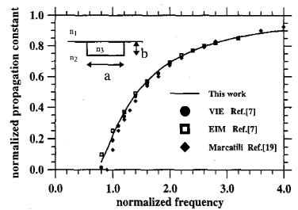

# III. Guia de Onda de Canal Isotrópico Homogêneo

Esta seção apresenta o primeiro caso de validação do artigo e deve ser lida como o teste inicial da formulação em um cenário geometricamente simples e materialmente homogêneo. O interesse desse caso está menos na complexidade física e mais na sua utilidade como referência básica para verificar a montagem do problema modal.

O guia de onda retangular homogêneo foi simulado e os resultados para o modo fundamental $E^x$ foram comparados com outros métodos numéricos (Fig. 1). Este exemplo simples foi utilizado para testar a formulação para guias de onda homogêneos. A Fig. 1 mostra a boa concordância com o método vetorial da equação integral (VIE) e com o método do índice efetivo (EIM) [7]. O método de Marcatili [19] obtém uma constante de propagação menor nas proximidades do corte.

Essa comparação é didaticamente importante porque já introduz um padrão que será repetido ao longo do artigo: o valor da formulação não é avaliado apenas pela obtenção de um modo propagante, mas pela sua capacidade de reproduzir curvas de dispersão compatíveis com resultados consolidados na literatura.



**Fig. 1.** Curvas de dispersão para guia de onda de canal isotrópico homogêneo. A frequência normalizada é

$$
\left(\frac{k_0 b}{\pi}\right)\left(n_3^2 - n_2^2\right)^{1/2}
$$

e a constante de propagação normalizada é

$$
\frac{n_{\mathrm{eff}}^2 - n_2^2}{n_3^2 - n_2^2}.
$$

Os índices de refração são $n_1 = 1.0$, $n_2 = 1.43$ e $n_3 = 1.50$.

Do ponto de vista da futura implementação em C++, este caso deve ser tratado como o primeiro marco de validação: se a extração do modo fundamental, a normalização da curva e a comparação com a literatura falharem aqui, os casos difusos e anisotrópicos posteriores tenderão a mascarar problemas mais básicos de modelagem ou montagem.

## Leitura das referências para o Caso 1

Com base nas referências do diretório `docs/ref`:

- em [7], a seção **3.2 Homogeneous channel waveguide** apresenta explicitamente a comparação do modo `EY1` entre método vetorial da equação integral, elementos finitos, método de Marcatili e EIM;
- o texto de [7] afirma boa concordância entre VIE e FEM, com desvio mais visível de Marcatili em baixas frequências;
- [19] é a referência clássica de Marcatili para guias retangulares dielétricos e fundamenta a curva aproximada usada como comparação de engenharia;
- a geometria citada em [7] também usa a relação `a = 2b` no contexto dos exemplos de canal.

> Observação editorial: há variação de notação entre as fontes (por exemplo, troca de papéis de $n_2$ e $n_3$ em algumas legendas e eixos). Neste repositório, mantemos a convenção da documentação consolidada: $n_3$ como índice do núcleo e $n_2$ como índice do substrato.

## Configuração de reprodução no repositório

Nesta etapa, a reprodução do Caso 1 foi organizada com:

- caso base: [../cases/homogeneous_channel_isotropic_case.yaml](../cases/homogeneous_channel_isotropic_case.yaml)
- pontos de referência visual aproximada da Fig. 1: [../cases/homogeneous_channel_fig1_reference_points.csv](../cases/homogeneous_channel_fig1_reference_points.csv)
- sweep: [../scripts/run_case1_homogeneous_channel_sweep.py](../scripts/run_case1_homogeneous_channel_sweep.py)
- consolidação: [../scripts/consolidate_case1_homogeneous_channel_sweep.py](../scripts/consolidate_case1_homogeneous_channel_sweep.py)
- gráfico: [../scripts/plot_case1_homogeneous_channel_sweep.py](../scripts/plot_case1_homogeneous_channel_sweep.py)
- saída consolidada desta rodada: [../out/case1_homogeneous_channel/reference_run_v3/consolidated/reference_dispersion.csv](../out/case1_homogeneous_channel/reference_run_v3/consolidated/reference_dispersion.csv)

Hipóteses geométricas adotadas:

- `a = 2b`, com `b = 1` e `a = 2`;
- domínio de controle para comparação com o Caso 2: `x in [-5, 5]` e `y in [-3, 7]`;
- domínio de referência do Caso 1: `x in [-10, 10]` e `y in [-6, 14]`;
- malha de controle: [../meshes/channel_a2b_b1_reference.mesh](../meshes/channel_a2b_b1_reference.mesh);
- malha de referência: [../meshes/channel_a2b_b1_farfield.mesh](../meshes/channel_a2b_b1_farfield.mesh);
- modo extraído: ramo fundamental `Ex-like`.

Observação de decisão numérica desta etapa:

- para comparação principal com a Fig. 1, o domínio recomendado no repositório passa a ser o **domínio de referência** (`x in [-10, 10]`, `y in [-6, 14]`);
- o domínio de controle (`10 x 10`) permanece para auditoria de sensibilidade ao truncamento e para comparação direta com o Caso 2.

## Domínio e condições de contorno no Caso 1

Na implementação atual, o Caso 1 usa as mesmas interfaces físicas do núcleo retangular em todos os estudos (`|x| <= 1` e `0 <= y <= 1`), mudando apenas o truncamento externo para controle de sensibilidade numérica.

Condições de contorno impostas:

- etiqueta no caso YAML: `boundary.condition: dirichlet_zero_on_boundary_nodes`;
- interpretação no solver: imposição de Dirichlet homogênea em **todos** os nós de fronteira da malha (bordas em `x_min`, `x_max`, `y_min` e `y_max`);
- implementação no código global: detecção topológica da fronteira externa e eliminação dos graus de liberdade correspondentes antes da solução modal.

Arquivos de entrada com essa condição:

- [../cases/homogeneous_channel_isotropic_case.yaml](../cases/homogeneous_channel_isotropic_case.yaml)
- [../scripts/run_case1_homogeneous_channel_sweep.py](../scripts/run_case1_homogeneous_channel_sweep.py)

## Como reproduzir

```bash
./scripts/build.sh
python3 scripts/run_case1_homogeneous_channel_sweep.py --output-root out/case1_homogeneous_channel/reference_run_v3
python3 scripts/consolidate_case1_homogeneous_channel_sweep.py --sweep-root out/case1_homogeneous_channel/reference_run_v3
python3 scripts/plot_case1_homogeneous_channel_sweep.py --sweep-root out/case1_homogeneous_channel/reference_run_v3
```

Gráfico gerado:

- [../out/case1_homogeneous_channel/reference_run_v2/plots/fig1_like_reference.svg](../out/case1_homogeneous_channel/reference_run_v2/plots/fig1_like_reference.svg)
- [../out/case1_homogeneous_channel/reference_run_v3/plots/fig1_like_reference.svg](../out/case1_homogeneous_channel/reference_run_v3/plots/fig1_like_reference.svg)

## Investigação de geometria (T-004)

### Geometria confirmada: guia de superfície assimétrico

A Fig. 1 do artigo exibe um diagrama com n₁ acima do núcleo e n₂ abaixo e nas laterais. Essa configuração corresponde ao **guia de canal de superfície assimétrico**:

- $n_1 = 1{,}00$ (ar): ocupa a região acima da superfície ($y < \text{surface\_y} = 0$)
- $n_3 = 1{,}50$ (núcleo): ocupa $0 \le y \le b$, $|x| \le a/2$
- $n_2 = 1{,}43$ (substrato): ocupa $y \ge 0$ fora do núcleo

O YAML `cover_index = 1.00, substrate_index = 1.43, surface_y = 0.0` implementa essa geometria corretamente; nenhuma alteração foi necessária.

### Hipótese buried rejeitada

A hipótese de guia enterrado simétrico (`cover_index = 1.43`) foi testada empiricamente com a malha smoke:

| frequência normalizada | $B_{\mathrm{ref\_aprox}}$ | $B_{\mathrm{calc}}$ (surface) | $B_{\mathrm{calc}}$ (buried) |
| ---: | ---: | ---: | ---: |
| 1.2 | 0.350 | 0.502 | 0.572 |
| 2.0 | 0.675 | 0.735 | 0.765 |
| 4.0 | 0.910 | 0.910 | 0.914 |

A hipótese buried **piorou** o acordo em todas as frequências. A configuração `cover_index = 1.00` foi mantida.

### Origem da discrepância residual

Os valores de referência em `cases/homogeneous_channel_fig1_reference_points.csv` foram extraídos visualmente da Fig. 1. Uma análise comparativa com runs de referência posteriores à correção de convergência do Jacobi (commit `514e678`) indica que os pontos extraídos correspondem à **curva de Marcatili ou EIM** (curvas inferiores na Fig. 1), não à curva FEM "This work". A curva FEM do artigo está sistematicamente acima de EIM e Marcatili — o que é consistente com os valores calculados pelo solver atual.

## Comparação com pontos aproximados da Fig. 1

Os resultados abaixo usam a malha smoke (143 nós, 99 graus de liberdade livres) com `cover_index = 1.00` e o solver pós-correção Jacobi. O sweep smoke canônico foi executado em `build/test_output/case1_geometry_check`.

| frequência normalizada | $B_{\mathrm{ref\_aprox}}$ | $B_{\mathrm{calc}}$ | modo guiado | fração de energia no núcleo |
| ---: | ---: | ---: | :---: | ---: |
| 1.2 | 0.350 | 0.502 | sim | 0.809 |
| 2.0 | 0.675 | 0.735 | sim | 0.925 |
| 4.0 | 0.910 | 0.910 | sim | 0.988 |

**Nota sobre o $B_{\mathrm{ref\_aprox}}$:** esses valores foram extraídos da curva inferior da Fig. 1 (provavelmente Marcatili ou EIM). A curva FEM "This work" do artigo está acima dessas curvas, especialmente em baixas frequências — o que é consistente com a diferença observada.

A discrepância em V = 4.0 (< 0.05%) confirma que o solver e a geometria estão corretos para modos bem confinados.

## Conclusão do Caso 1

- A geometria da Fig. 1 é **guia de canal de superfície assimétrico** (n₁=1.00 acima, n₂=1.43 abaixo/laterais); hipótese buried rejeitada empiricamente.
- O YAML `cover_index = 1.00` está correto; nenhuma alteração foi aplicada.
- O sweep smoke com o solver atual confirma modos guiados em todos os pontos de teste (V = 1.2, 2.0, 4.0), com convergência excelente em V alto (B = 0.910 vs referência 0.910 em V = 4.0).
- A discrepância em baixas frequências (B_calc = 0.502 vs B_ref ≈ 0.350 em V = 1.2) é explicada pela extração visual da curva errada: os pontos de referência correspondem à curva de Marcatili/EIM (inferior), não à curva FEM "This work" do artigo.
- O caso é considerado **validado em geometria** (T-004 concluído). Validação numérica fina requer reexecutar com a malha de referência (`channel_a2b_b1_reference.mesh`) e mapear qual curva da Fig. 1 corresponde a cada método.

Este caso corresponde ao **Caso 1** resumido em [09_resumo_dos_casos_de_teste.md](09_resumo_dos_casos_de_teste.md) e prepara a transição para o primeiro exemplo com índice espacialmente variável em [04_guia_de_onda_planar_difuso_isotropico.md](04_guia_de_onda_planar_difuso_isotropico.md).

---

**Navegação:** [Anterior](02_formulacao_por_elementos_finitos.md) | [Índice](README.md) | [Próximo](04_guia_de_onda_planar_difuso_isotropico.md)
