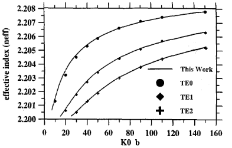

# IV. Guia de Onda Planar Difuso Isotrópico

Esta seção documenta, de forma reprodutível, o **Caso 2** do artigo: o guia de onda planar difuso isotrópico usado como primeiro benchmark com perfil material variável. Esse caso é especialmente importante porque faz a ponte entre a formulação por elementos finitos da Seção [II](02_formulacao_por_elementos_finitos.md) e um problema para o qual existe uma referência analítica independente.

No artigo base do caso planar [6], os autores aplicam o método a um guia planar com perfil exponencial justamente porque, nesse cenário, a solução exata já era conhecida a partir de [19]. A comparação com essa solução exata é o que sustenta a validade do método antes da passagem para casos bidimensionais mais ricos, como os guias de canal difusos.

## Descrição do caso nas referências

De acordo com [6], para o caso planar deve-se tomar, na geometria geral da Fig. 1 do artigo,

- $n_m = n_f = n_0$;
- $f(x,y) = \exp(-y/d)$;
- $d = 1.0$;
- $n_0 = 1.0$;
- $n_s = 2.2$;
- $\Delta n = 0.01$.

O artigo [6] informa ainda que:

- a divisão em elementos do caso planar aparece na **Fig. 2** do artigo original;
- a curva de dispersão modal aparece na **Fig. 3** do artigo original;
- a comparação é feita para os três modos TE de menor ordem: `TE0`, `TE1` e `TE2`;
- o parâmetro de dispersão mostrado no eixo horizontal é $k_0 d$.

Isso significa que a leitura física correta do benchmark não é a de um perfil simétrico em torno de $y = 0$, mas sim a de um **perfil unilateral em profundidade**, com uma interface na superfície e um substrato semi-infinito difundido.

## Perfil material usado na reprodução

A forma simplificada abaixo,

$$
n(y) = 2.20 + 0.01 \exp\left(-\frac{|y|}{b}\right),
$$

é útil como intuição inicial, mas **não** é a forma adotada na reprodução final do Caso 2 neste repositório. A reprodução alinhada às referências [6] e [19] usa o seguinte modelo:

- para a cobertura, $y < 0$:

$$
n(y) = n_0 = 1.0;
$$

- para o substrato difundido, $y \ge 0$:

$$
n(y) = n_s + \Delta n \exp\left(-\frac{y}{d}\right),
$$

com $n_s = 2.2$, $\Delta n = 0.01$ e $d = 1.0$.

Para compatibilizar o benchmark analítico de [19] com a implementação numérica, o repositório usa, no substrato, a permissividade linearizada:

$$
\varepsilon_r(y) = n_s^2 + 2 n_s \Delta n \exp\left(-\frac{y}{d}\right), \qquad y \ge 0,
$$

enquanto na cobertura vale

$$
\varepsilon_r = n_0^2 = 1.
$$

Essa linearização é consistente com a hipótese de pequena variação de índice, já que $\Delta n \ll n_s$, e é exatamente a aproximação usada por Conwell em [19] para obter a solução analítica do guia difuso exponencial.

## Interpretação geométrica e truncamento numérico

Embora o problema físico seja planar, o solver do repositório trabalha com malhas triangulares P1 em 2D. Para não introduzir uma largura lateral artificial como parâmetro físico do caso, a reprodução numérica atual adota:

- domínio computacional total de `10 x 10` unidades;
- faixa lateral em $x \in [-5, 5]$ usada apenas como **buffer numérico**;
- superfície em $y = 0$;
- cobertura truncada em $y = -2$;
- substrato truncado em $y = 8$.

Na malha de referência, a discretização é fortemente refinada nas vizinhanças de $y = 0$ e nas primeiras profundidades de difusão, que são justamente as regiões mais sensíveis para o acoplamento modal e para a aproximação do perfil exponencial.

Além disso, o caso ativa no solver uma **redução global $x$-invariante**, de modo que todos os nós em um mesmo nível de $y$ compartilham o mesmo grau de liberdade modal. Isso é importante porque elimina famílias artificiais de modos laterais num problema cuja física, neste benchmark, depende apenas da profundidade.

## Configuração usada no repositório

Os arquivos principais da reprodução atual são:

- caso base YAML: [../cases/planar_diffuse_isotropic_case.yaml](../cases/planar_diffuse_isotropic_case.yaml)
- malha de referência: [../meshes/planar_d10_a2b_reference.mesh](../meshes/planar_d10_a2b_reference.mesh)
- script do sweep: [../scripts/run_planar_diffuse_sweep.py](../scripts/run_planar_diffuse_sweep.py)
- benchmark analítico TE: [../scripts/planar_exact_reference.py](../scripts/planar_exact_reference.py)

O sweep de referência é feito nos 11 pontos:

$$
k_0 d \in \{5, 10, 15, 20, 30, 40, 50, 70, 90, 110, 150\}.
$$

Os valores extraídos da figura do artigo e usados como referência gráfica estão em:

- [../cases/planar_diffuse_isotropic_fig2_reference_points.csv](../cases/planar_diffuse_isotropic_fig2_reference_points.csv)

## Como reproduzir o cálculo

Compilação:

```bash
./scripts/build.sh
```

Execução do sweep de referência:

```bash
python3 scripts/run_planar_diffuse_sweep.py --skip-build --output-root out/planar_diffuse_sweep/case2_exact_refined
```

Consolidação:

```bash
python3 scripts/consolidate_planar_diffuse_sweep.py --sweep-root out/planar_diffuse_sweep/case2_exact_refined
```

Geração do gráfico:

```bash
python3 scripts/plot_planar_diffuse_sweep.py --sweep-root out/planar_diffuse_sweep/case2_exact_refined
```

Artefatos principais:

- gráfico comparativo final: [../out/planar_diffuse_sweep/case2_exact_refined/plots/fig2_like_reference.svg](../out/planar_diffuse_sweep/case2_exact_refined/plots/fig2_like_reference.svg)
- comparação FEM vs. pontos aproximados da figura: [../out/planar_diffuse_sweep/case2_exact_refined/consolidated/reference_comparison.csv](../out/planar_diffuse_sweep/case2_exact_refined/consolidated/reference_comparison.csv)
- benchmark exato TE: [../out/planar_diffuse_sweep/case2_exact_refined/consolidated/analytic_reference.csv](../out/planar_diffuse_sweep/case2_exact_refined/consolidated/analytic_reference.csv)
- comparação FEM vs. solução exata: [../out/planar_diffuse_sweep/case2_exact_refined/consolidated/fem_vs_exact_comparison.csv](../out/planar_diffuse_sweep/case2_exact_refined/consolidated/fem_vs_exact_comparison.csv)

## Resumo do cálculo analítico de [19]

Para modos TE planares, escreve-se o campo na forma

$$
E_y(x,y,t) = F(y)\exp\left[i(\beta x - \omega t)\right].
$$

No substrato difundido, a equação escalar de onda reduz-se a

$$
\frac{d^2 F}{dy^2} + \left(k_0^2 \varepsilon(y) - \beta^2\right)F = 0,
$$

com

$$
\varepsilon(y) = \varepsilon_s + \Delta \varepsilon \exp\left(-\frac{y}{d}\right),
$$

onde

$$
\varepsilon_s = n_s^2, \qquad \Delta \varepsilon \approx 2 n_s \Delta n.
$$

Conwell [19] mostra que essa equação admite solução exata em termos de funções de Bessel. No repositório, a implementação analítica foi organizada em torno da variável de ordem

$$
\nu = 2 d p_s,
$$

e do argumento

$$
\xi = 2 k_0 d \sqrt{\Delta \varepsilon}.
$$

Com essas definições, a continuidade do campo e de sua derivada tangencial na interface produz uma equação característica TE equivalente à Eq. (8) de [19], resolvida numericamente por busca de raízes. Uma vez encontrada a raiz admissível $\nu$, recupera-se

$$
n_{\mathrm{eff}} = \frac{\beta}{k_0}
= \sqrt{\varepsilon_s + \left(\frac{\nu}{2 k_0 d}\right)^2}.
$$

Na prática, isso transforma o benchmark analítico em um problema escalar de determinação de raízes, o que é uma excelente referência para validar o solver por elementos finitos sem depender apenas da digitalização visual da figura do artigo.

## Figura do artigo e gráfico gerado

Mantém-se abaixo a figura documental já utilizada na pasta `docs`, agora complementada pelo gráfico gerado pelo repositório.



O gráfico gerado automaticamente pelo repositório, já com a sobreposição entre FEM, pontos aproximados da figura e solução exata de [19], está em:

- [../out/planar_diffuse_sweep/case2_exact_refined/plots/fig2_like_reference.svg](../out/planar_diffuse_sweep/case2_exact_refined/plots/fig2_like_reference.svg)

## Tabelas comparativas da reprodução atual

Nas tabelas seguintes:

- `ref` = valor analítico calculado a partir da equação característica TE de [19], conforme implementado em [../scripts/planar_exact_reference.py](../scripts/planar_exact_reference.py);
- `calc` = valor calculado pelo FEM na execução `case2_exact_refined`;
- o erro relativo percentual é definido por

$$
\frac{\left|\text{ref} - \text{calc}\right|}{\left|\text{ref}\right|} \times 100.
$$

Como o benchmark analítico também respeita o cutoff modal, as tabelas incluem apenas os pontos em que cada modo TE está efetivamente disponível na solução de referência.

### TE0

| $k_0 d$ | $n_{\mathrm{eff}}^{\mathrm{ref}}$ | $n_{\mathrm{eff}}^{\mathrm{calc}}$ | erro relativo (\%) |
|---:|---:|---:|---:|
| 10 | 2.201042 | 2.201073 | 0.001408 |
| 15 | 2.202297 | 2.202338 | 0.001862 |
| 20 | 2.203226 | 2.203275 | 0.002224 |
| 30 | 2.204464 | 2.204521 | 0.002586 |
| 40 | 2.205255 | 2.205315 | 0.002721 |
| 50 | 2.205809 | 2.205869 | 0.002720 |
| 70 | 2.206546 | 2.206597 | 0.002311 |
| 90 | 2.207023 | 2.207061 | 0.001722 |
| 110 | 2.207361 | 2.207387 | 0.001178 |
| 150 | 2.207815 | 2.207827 | 0.000544 |

### TE1

| $k_0 d$ | $n_{\mathrm{eff}}^{\mathrm{ref}}$ | $n_{\mathrm{eff}}^{\mathrm{calc}}$ | erro relativo (\%) |
|---:|---:|---:|---:|
| 15 | 2.200085 | 2.200079 | 0.000273 |
| 20 | 2.200602 | 2.200620 | 0.000818 |
| 30 | 2.201760 | 2.201779 | 0.000863 |
| 40 | 2.202690 | 2.202717 | 0.001226 |
| 50 | 2.203408 | 2.203432 | 0.001089 |
| 70 | 2.204435 | 2.204443 | 0.000363 |
| 90 | 2.205136 | 2.205135 | 0.000045 |
| 110 | 2.205649 | 2.205645 | 0.000181 |
| 150 | 2.206358 | 2.206347 | 0.000499 |

### TE2

| $k_0 d$ | $n_{\mathrm{eff}}^{\mathrm{ref}}$ | $n_{\mathrm{eff}}^{\mathrm{calc}}$ | erro relativo (\%) |
|---:|---:|---:|---:|
| 30 | 2.200483 | 2.200485 | 0.000091 |
| 40 | 2.201240 | 2.201237 | 0.000136 |
| 50 | 2.201932 | 2.201908 | 0.001090 |
| 70 | 2.203024 | 2.202992 | 0.001453 |
| 90 | 2.203820 | 2.203782 | 0.001724 |
| 110 | 2.204424 | 2.204385 | 0.001769 |
| 150 | 2.205282 | 2.205210 | 0.003265 |

## Conclusões principais do Caso 2

- A leitura fisicamente correta do benchmark é a de um guia planar com perfil **unilateral** em profundidade, e não a de um perfil par em $|y|$.
- O caso deve ser parametrizado por $d$, com a curva de dispersão apresentada em função de $k_0 d$.
- A cobertura do problema de referência é homogênea com $n_0 = 1.0$, enquanto o substrato tende a $n_s = 2.2$.
- A reprodução numérica atual do repositório ficou consistente com o benchmark analítico de [19] na ordem de $10^{-4}$ em $n_{\mathrm{eff}}$.
- Em relação à solução exata implementada no repositório, os maiores desvios absolutos observados nesta rodada foram de aproximadamente `0.000060` para `TE0`, `0.000027` para `TE1` e `0.000072` para `TE2`.
- Em termos percentuais relativos à referência analítica, isso corresponde a erros máximos de aproximadamente `0.002721%` para `TE0`, `0.001226%` para `TE1` e `0.003265%` para `TE2`.
- Os pontos aproximados da figura do artigo continuam úteis como verificação visual, mas a referência técnica principal do Caso 2 passa a ser a solução analítica de [19], que é mais apropriada para avaliar a qualidade do FEM.

Em termos didáticos, este caso cumpre exatamente o papel esperado dentro da sequência de validação: ele confirma a montagem local e global em um problema com perfil material variável, mas ainda suficientemente simples para admitir uma verificação analítica independente.

Este caso corresponde ao **Caso 2** resumido em [09_resumo_dos_casos_de_teste.md](09_resumo_dos_casos_de_teste.md) e prepara o avanço para os guias de canal difusos tratados em [05_guia_de_onda_de_canal_difuso_isotropico.md](05_guia_de_onda_de_canal_difuso_isotropico.md).

---

**Navegação:** [Anterior](03_guia_de_onda_de_canal_isotropico_homogeneo.md) | [Índice](README.md) | [Próximo](05_guia_de_onda_de_canal_difuso_isotropico.md)
