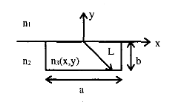
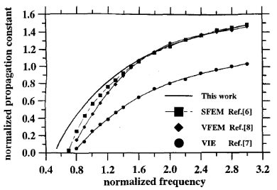
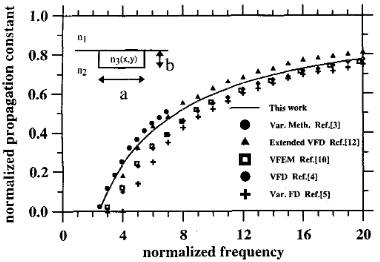

# V. Guia de Onda de Canal Difuso Isotrópico

Foi considerado um guia de onda com seção transversal retangular, no qual uma difusão circular foi realizada apenas no interior de um núcleo retangular (Fig. 3).

**Fig. 3.** Geometria do guia de onda de canal.

O índice de refração para a difusão circular é dado por [8]:

$$
n_3 = n_2 + \frac{n_2 - n_{3m}}{L^2}\left(x^2 + y^2 - L^2\right),
\tag{7}
$$

em que $n_2$ é o valor do índice no substrato, e $n_3$ e $n_{3m}$ são, respectivamente, o índice de refração e o índice de refração máximo no interior do guia de onda. $L$ é o comprimento do segmento de reta que vai da origem até um ponto na fronteira do núcleo e que intercepta um ponto $P(x,y)$. Se as coordenadas retangulares de $P$ satisfazem $|y| \geq |x|$, então:

$$
L = \sqrt{b^2 + x^2},
\tag{8}
$$

caso contrário,

$$
L = \sqrt{\left(\frac{a}{2}\right)^2 + y^2}.
\tag{9}
$$

onde $a$ e $b$ são, respectivamente, a largura e a altura da seção transversal retangular. Todo o domínio (incluindo a região de ar) foi discretizado em uma malha de 5680 triângulos lineares de primeira ordem, correspondendo a 2800 nós. Para se obter uma melhor descrição dos modos próximos à condição de corte, essa malha foi refinada no interior do núcleo e em todas as regiões do substrato onde a intensidade do campo não é desprezível. Os valores adotados para a simulação foram $n_2 = 1.44$, $n_{3m} = 1.5$ e $n_1 = 1.0$. Longe da região de corte, os resultados obtidos por nossa implementação para um guia de onda difuso isotrópico apresentam boa concordância com os resultados apresentados na literatura (Figs. 4 e 5). Próximo da região de corte, aparecem discrepâncias entre todas as simulações. As curvas mostradas na Fig. 4 permitem a comparação dos resultados obtidos por um método vetorial da equação integral [7], uma formulação vetorial por elementos finitos (VFEM) [8] e uma formulação escalar por elementos finitos (SFEM) [6].

**Fig. 4.** Curvas de dispersão para o modo $E^x_{11}$ em um guia de onda com perfil de índice circular. A frequência normalizada é

$$
\left(\frac{k_0 b}{\pi}\right)\left(n_{3av}^2 - n_2^2\right)^{1/2}
$$

e a constante de propagação normalizada é

$$
\frac{n_{\mathrm{eff}}^2 - n_2^2}{n_{3av}^2 - n_2^2},
$$

onde $n_{3av} = 1.47$ é o índice médio na região do núcleo.

**Fig. 5.** Curvas de dispersão para o modo $E^x_{11}$ em guia de onda de canal isotrópico difuso com perfil de índice Gaussian-Gaussian.

$$
n_3 = n_2 \left(1 + 0.05\, f(x,y)\right), \qquad \frac{a}{b} = 1.
$$

A frequência normalizada é

$$
\left(\frac{k_0 b}{\pi}\right)\left(n_{3m}^2 - n_2^2\right)^{1/2}
$$

e a constante de propagação normalizada é

$$
\frac{n_{\mathrm{eff}}^2 - n_2^2}{n_{3m}^2 - n_2^2},
$$

com $n_1 = 1.0$, $n_2 = (2.1)^{1/2}$ e $n_{3m} = 1.05\,n_2$.

Além disso, deve-se observar na Fig. 5 que a formulação escalar utilizada neste trabalho reproduz muito bem os resultados obtidos por outros métodos, a saber: o Método Variacional (VM) [3], os Métodos Vetorial por Elementos Finitos (Vector FE) [10] e Vetorial por Diferenças Finitas (VFD) [4], o Método Vetorial por Diferenças Finitas Estendido [12] e o Método Variacional por Diferenças Finitas (Var. FD) [5]. Para uma região próxima ao corte, nossos resultados, mostrados na Fig. 5, estão em boa concordância com os resultados apresentados em [3], que também utiliza uma malha refinada na região de interesse.
