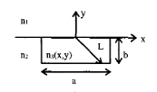
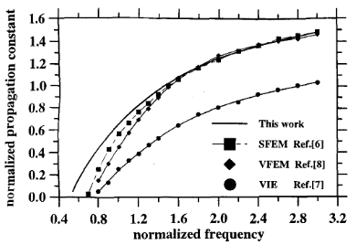
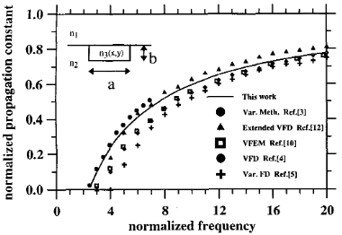

# V. Guia de Onda de Canal Difuso Isotrópico

Esta seção reúne dois casos de validação isotrópicos em geometria de canal. Em comparação com a seção anterior, o ganho de complexidade aqui vem tanto da forma bidimensional da seção transversal quanto da necessidade de descrever perfis de índice mais elaborados e de comparar o comportamento modal, especialmente, nas proximidades do corte.

## A. Perfil circular em núcleo retangular

Foi considerado um guia de onda com seção transversal retangular, no qual uma difusão circular foi realizada apenas no interior de um núcleo retangular (Fig. 3).

**Fig. 3.** Geometria do guia de onda de canal.

O índice de refração para a difusão circular é dado por [8]:

## (7)

$$
n_3 = n_2 + \frac{n_2 - n_{3m}}{L^2}\left(x^2 + y^2 - L^2\right),
$$

em que $n_2$ é o valor do índice no substrato, e $n_3$ e $n_{3m}$ são, respectivamente, o índice de refração e o índice de refração máximo no interior do guia de onda. $L$ é o comprimento do segmento de reta que vai da origem até um ponto na fronteira do núcleo e que intercepta um ponto $P(x,y)$. Se as coordenadas retangulares de $P$ satisfazem $|y| \geq |x|$, então:

## (8)

$$
L = \sqrt{b^2 + x^2},
$$

caso contrário,

## (9)

$$
L = \sqrt{\left(\frac{a}{2}\right)^2 + y^2}.
$$

onde $a$ e $b$ são, respectivamente, a largura e a altura da seção transversal retangular. Todo o domínio (incluindo a região de ar) foi discretizado em uma malha de 5680 triângulos lineares de primeira ordem, correspondendo a 2800 nós. Para se obter uma melhor descrição dos modos próximos à condição de corte, essa malha foi refinada no interior do núcleo e em todas as regiões do substrato onde a intensidade do campo não é desprezível. Os valores adotados para a simulação foram $n_2 = 1.44$, $n_{3m} = 1.5$ e $n_1 = 1.0$. Longe da região de corte, os resultados obtidos pelos autores com a presente formulação para um guia de onda difuso isotrópico apresentam boa concordância com os resultados apresentados na literatura (Figs. 4 e 5). Próximo da região de corte, aparecem discrepâncias entre todas as simulações. As curvas mostradas na Fig. 4 permitem a comparação dos resultados obtidos por um método vetorial da equação integral [7], uma formulação vetorial por elementos finitos (VFEM) [8] e uma formulação escalar por elementos finitos (SFEM) [6].

As equações (7)-(9) deixam explícito que o perfil é construído de forma geométrica e por partes. Em particular, no centro do guia obtém-se o valor máximo $n_{3m}$, enquanto na fronteira do núcleo o perfil retorna ao valor do substrato $n_2$. Esse detalhe é útil para conferir se a implementação do perfil material está coerente antes mesmo da solução do problema modal.

**Fig. 4.** Curvas de dispersão para o modo $E^x_{11}$ em um guia de onda com perfil de índice circular. A frequência normalizada é

$$
\left(\frac{k_0 b}{\pi}\right)\left(n_{3av}^2 - n_2^2\right)^{1/2}
$$

e a constante de propagação normalizada é

$$
\frac{n_{\mathrm{eff}}^2 - n_2^2}{n_{3av}^2 - n_2^2},
$$

onde $n_{3av} = 1.47$ é o índice médio na região do núcleo.

Esse primeiro caso de canal difuso isotrópico é particularmente útil para estudar o impacto do refinamento de malha e a sensibilidade numérica perto do corte, dois pontos que retornam mais tarde nas conclusões do artigo.

## Reprodução computacional do Caso 3 (2026-06-15)

O perfil circular foi implementado em `src/material_profile.cpp` e testado via `cases/channel_diffused_isotropic_case.yaml` com a malha `channel_a2b_b1_reference.mesh` (304 nós, 540 elementos).

**Auditoria T-005 — flags delta_x/delta_z:** `docs/02` §3 afirma explicitamente que F2, F3 e F4 são não-simétricas ("esparsas e não simétricas devido à presença de termos com $dn^2/d\zeta$") quando os flags estão ativos. O eigensolver Jacobi atual exige simetria e retorna 0 modos com F assimétrica. Os flags permanecem `false` com BLOCKER documentado em `src/material_profile.cpp` linhas 309–316. Próxima ação: eigensolver QZ/LAPACK (T-009).

**Sweep de reprodução (15 pontos, V = 1.5..5.0):** executado com `scripts/run_case3_channel_diffused_sweep.py`. Com delta_x/delta_z desativados, o solver subestima os efeitos de gradiente, resultando em neff > n3av em todos os pontos e B > 1 (acima do limite da Fig. 4). A curva calculada é uma **aproximação inferior** do modelo completo: indica guiamento, mas superestima o confinamento.

**Artefatos finais:**

- CSV: `out/case3_channel_diffused_isotropic/final_run/consolidated/dispersion_curve.csv`
- SVG: `out/case3_channel_diffused_isotropic/final_run/plots/fig4_like_reference.svg`

O SVG inclui nota explícita de limitação T-005 e eixo B estendido até 1.5 para acomodar os valores calculados.

## B. Perfil Gaussian-Gaussian

Além do perfil circular, os autores também analisaram um guia de onda de canal isotrópico difuso com perfil de índice do tipo Gaussian-Gaussian, novamente com foco nas curvas de dispersão do modo $E^x_{11}$ e na comparação com diferentes formulações numéricas.

**Fig. 5.** Curvas de dispersão para o modo $E^x_{11}$ em guia de onda de canal isotrópico difuso com perfil de índice Gaussian-Gaussian.

$$
n_3 = n_2 \left(1 + 0.05\, f(x,y)\right), \qquad \frac{a}{b} = 1.
$$

Com a referência [12] disponível em `docs/ref/`, a função do perfil pode ser
registrada explicitamente como

$$
f(x,y) =
\exp\left[-\frac{4(x-x_0)^2}{a^2}\right]\,
\exp\left[-\left(\frac{y}{b}\right)^2\right],
$$

onde $x_0$ é a abscissa do ponto central do guia. Na implementação deste
repositório, a origem em profundidade usada nessa fórmula é mapeada para a
superfície `surface_y`; assim, para `y >= surface_y`,

$$
n(x,y) =
n_2 + (n_{3m}-n_2)
\exp\left[-\frac{4(x-x_0)^2}{a^2}\right]
\exp\left[-\frac{(y-y_s)^2}{b^2}\right],
$$

e para `y < surface_y` usa-se o índice da cobertura $n_1$.

A frequência normalizada é

$$
\left(\frac{k_0 b}{\pi}\right)\left(n_{3m}^2 - n_2^2\right)^{1/2}
$$

e a constante de propagação normalizada é

$$
\frac{n_{\mathrm{eff}}^2 - n_2^2}{n_{3m}^2 - n_2^2},
$$

com $n_1 = 1.0$, $n_2 = (2.1)^{1/2}$ e $n_{3m} = 1.05\,n_2$.

Além disso, deve-se observar na Fig. 5 que a formulação escalar utilizada neste trabalho reproduz muito bem os resultados obtidos por outros métodos, a saber: o Método Variacional (VM) [3], os Métodos Vetorial por Elementos Finitos (Vector FE) [10] e Vetorial por Diferenças Finitas (VFD) [4], o Método Vetorial por Diferenças Finitas Estendido [12] e o Método Variacional por Diferenças Finitas (Var. FD) [5]. Para uma região próxima ao corte, os resultados mostrados na Fig. 5 estão em boa concordância com os resultados apresentados em [3], que também utiliza uma malha refinada na região de interesse.

> Observação editorial atualizada: a definição de $f(x,y)$ foi recuperada da legenda da Fig. 4 da referência [12], que é reutilizada pelas Figs. 5-7 dessa mesma referência. A implementação inicial do Caso 4 ainda mantém os termos de gradiente `delta_x/delta_z` desativados pelo mesmo bloqueio T-005 do Caso 3, até existir eigensolver generalizado não simétrico.

Os dois exemplos desta seção correspondem aos **Casos 3 e 4** sintetizados em [09_resumo_dos_casos_de_teste.md](09_resumo_dos_casos_de_teste.md). Em conjunto, eles encerram a etapa isotrópica da validação e preparam a passagem para os materiais anisotrópicos em [06_guia_de_onda_de_canal_difuso_anisotropico.md](06_guia_de_onda_de_canal_difuso_anisotropico.md).

---

**Navegação:** [Anterior](04_guia_de_onda_planar_difuso_isotropico.md) | [Índice](README.md) | [Próximo](06_guia_de_onda_de_canal_difuso_anisotropico.md)
