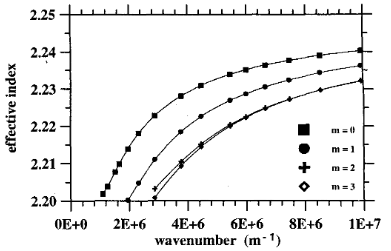
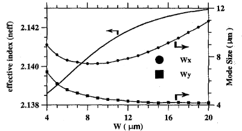

# VI. Guia de Onda de Canal Difuso Anisotrópico

Depois dos casos isotrópicos, esta seção introduz os exemplos que motivam diretamente o foco principal do artigo: guias de onda difusos em materiais anisotrópicos de interesse tecnológico. Aqui, a formulação deixa de ser validada apenas contra perfis espaciais variáveis e passa também a ser confrontada com modelos materiais mais ricos, dependentes do processo físico de fabricação.

## A. Guia de onda obtido por troca protônica com recozimento

Guias de onda ópticos de $LiNbO_3$ obtidos por troca protônica com recozimento (*annealed proton exchange* — APE) possuem a propriedade de polarização única, porque o processo APE altera apenas o índice de refração extraordinário.

Essa observação é central para a leitura desta subseção: a anisotropia não aparece apenas como um formalismo tensorial abstrato, mas como consequência direta do processo de fabricação e da resposta óptica diferenciada do material.

A variação do índice após o processo de troca protônica (PE) é aproximada por um índice inicial em degrau ($\Delta n_{\mathrm{PE}} = 0.12$). Subsequentemente, o processo de recozimento foi simulado por uma equação de difusão anisotrópica linear bidimensional resolvida pelo método dos elementos finitos.

A variação do índice extraordinário foi relacionada à concentração de prótons no substrato da seguinte forma [20]:

### (10)

$$
n_e(C) = n_{es} + \Delta n_e \left[1 - \exp(-11C)\right],
$$

onde $C$ é a concentração normalizada de prótons ($0 < C < 1$), $n_{es}$ é o índice de refração extraordinário do $LiNbO_3$ e $\Delta n_e$ é a variação máxima do índice de refração induzida pelo processo de troca protônica (PE).

A Fig. 6 mostra as curvas de dispersão para os quatro modos $E^x$ de menor ordem em um guia APE de $LiNbO_3$ com corte em $x$. Os tempos de PE e de recozimento são, respectivamente, quinze minutos a $190^\circ$C e quatro horas a $360^\circ$C.

A dispersão do índice de refração não foi considerada neste exemplo. Uma análise detalhada para esse caso foi apresentada em um trabalho anterior [9].

**Fig. 6.** Curvas de dispersão para os quatro modos $E^x$ de menor ordem em guia de onda APE de $LiNbO_3$ com corte em $x$. Para $360^\circ$C, as constantes de difusão do recozimento são $D_a(x\text{-cut}) = 0.92\ \mu\text{m}^2/\text{h}$, $D_a(z\text{-cut}) = 0.77\ \mu\text{m}^2/\text{h}$, e $\lambda_0 = 0.6328\ \mu\text{m}$.

Do ponto de vista didático, este é o primeiro caso em que o leitor precisa acompanhar, simultaneamente, a formulação modal, a anisotropia do meio e a origem física do perfil de índice. Para a futura implementação, isso sugere separar claramente a discretização FEM da modelagem específica do processo APE.

## B. Guia de onda Ti-difundido em $LiNbO_3$

Se o caso APE já introduz anisotropia e difusão, o guia $Ti:LiNbO_3$ acrescenta ainda dependência explícita de comprimento de onda e parâmetros distintos para os ramos extraordinário e ordinário. Trata-se, portanto, do caso materialmente mais rico entre os exemplos do artigo.

Para guias de onda de canal $Ti:LiNbO_3$, o índice de refração na região difundida segue [21]:

### (11)

$$
n_{e,o}^2(x,y,\lambda) = n_{b_{e,o}}^2 + \left[ \left(n_{b_{e,o}} + \Delta n_{s_{e,o}}\right)^2 - n_{b_{e,o}}^2 \right] \exp\left(-\frac{y^2}{d_y^2}\right) f\left(\frac{2x}{W}\right)
$$

onde

### (12)

$$
f\left(\frac{2x}{W}\right) = \frac{1}{2} \left\{
\operatorname{erf} \left[ \frac{W}{2d_x} \left( 1 + \frac{2x}{W} \right) \right] + \operatorname{erf} \left[ \frac{W}{2d_x} \left( 1 - \frac{2x}{W} \right) \right] \right\},
$$

os subscritos $e$ e $o$ denotam, respectivamente, os ramos extraordinário e ordinário; $x$ e $y$ são as coordenadas de um ponto no substrato; $W$ é a largura inicial da faixa de Ti; $d_x$ e $d_y$ são, respectivamente, a largura e a profundidade de difusão; $n_b$ é o índice de refração do substrato; e $\Delta n_s$ representa a variação do índice superficial com o comprimento de onda. A função $\operatorname{erf}$ denota a função erro.

Além disso, $\Delta n_{s_{e,o}}$ é dado em termos de $H$ (a espessura inicial da faixa de Ti) e de alguns parâmetros de ajuste [22]:

### (13)

$$
\Delta n_{s_{e,o}}(\lambda) = \left[ B_0(\lambda) + B_1(\lambda)\frac{H}{d_{y_{e,o}}} \right] \left( \frac{H}{d_{y_{e,o}}} \right)^{\alpha_{e,o}},
$$

com

$$
\alpha_e = 0.83,
\qquad
\alpha_o = 0.53,
$$

$$
B_{0_e}(\lambda) = 0.385 - 0.430\lambda + 0.171\lambda^2,
$$

$$
B_{1_e}(\lambda) = 9.130 + 3.850\lambda - 2.490\lambda^2,
$$

$$
B_{0_o}(\lambda) = 0.0653 - 0.0315\lambda + 0.0071\lambda^2,
$$

$$
B_{1_o}(\lambda) = 0.4780 + 0.4640\lambda - 0.3480\lambda^2.
$$

As simulações foram realizadas para um guia construído em um cristal com corte em $x$, com espessura inicial da faixa de Ti igual a $H = 100$ nm, $\lambda = 1.523\ \mu\text{m}$, $T = 1050^\circ$C e tempo de difusão $t = 8.5$ h. Usando os parâmetros de difusão obtidos de [21] e [22], foram derivados os seguintes dados de entrada:

$$
d_{xe} = 4.60\ \mu\text{m},
\qquad
d_{ye} = 4.00\ \mu\text{m},
$$

$$
d_{xo} = 6.23\ \mu\text{m},
\qquad
d_{yo} = 4.98\ \mu\text{m},
$$

$$
n_{be} = 2.2125,
\qquad
n_{bo} = 2.1383,
$$

$$
\Delta n_{se} = 0.00446,
\qquad
\Delta n_{so} = 0.01217.
$$

A Fig. 7 mostra o índice efetivo calculado para o modo $E^x_{11}$ e os tamanhos de modo $W_x$ e $W_y$ (largura total à meia altura da intensidade de campo) em função da largura inicial da faixa de Ti. O comportamento dessas curvas está em boa concordância com os resultados apresentados em [21]. Esses resultados não foram incluídos na figura porque suas curvas foram obtidas para um cristal com corte em $c$.

**Fig. 7.** Índice efetivo ($n_{\mathrm{eff}}$) e tamanhos de modo $W_x$ e $W_y$ em função da largura inicial da faixa de Ti.

Uma observação importante para a implementação é que as expressões (11)-(13) usam a mesma forma funcional para os dois ramos, mas com parâmetros distintos. Em um código futuro, isso sugere instanciar explicitamente os conjuntos extraordinário e ordinário de parâmetros, evitando tratar $d_x$, $d_y$, $n_b$ e $\Delta n_s$ como quantidades únicas quando o caso físico exigir diferenciação entre os ramos.

Os exemplos desta seção correspondem aos **Casos 5 e 6** sintetizados em [09_resumo_dos_casos_de_teste.md](09_resumo_dos_casos_de_teste.md) e fecham a sequência de validação física do artigo antes das conclusões em [07_conclusoes.md](07_conclusoes.md).

---

**Navegação:** [Anterior](05_guia_de_onda_de_canal_difuso_isotropico.md) | [Índice](README.md) | [Próximo](07_conclusoes.md)
